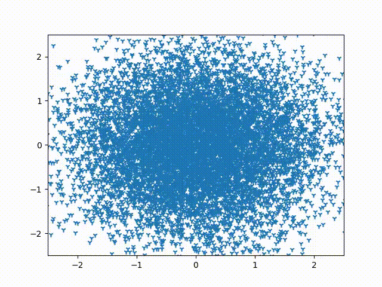

# Toy diffusion

This is an implementation of a toy diffusion process, able the generate samples from a learned 2-dimensional distribution. It is an alternative implementation of the experiment presented in Sohl-Dickstein et al paper on using diffusion models and deep networks to generate new samples for a given dataset.

A simple pytorch network learns to predict the noise component in a data sample. This is then used in a DDPM sampler to generate new samples from the distribution.

Here is an example of generation of samples for a 2D swiss roll distribution:

## References

* [Sohl-Dickstein et al - Deep Unsupervised Learning using Nonequilibrium Thermodynamics](https://arxiv.org/pdf/1503.03585.pdf)
* [Ho et al - Denoising Diffusion Probabilistic Models](https://arxiv.org/pdf/2006.11239.pdf)
* [Nichol and Dhariwal – Improving Denoising Diffusion Probabilistic Models](https://arxiv.org/pdf/2102.09672.pdf)
